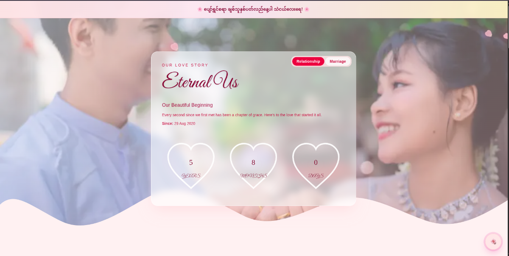
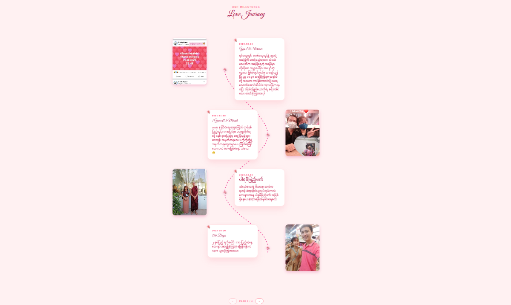
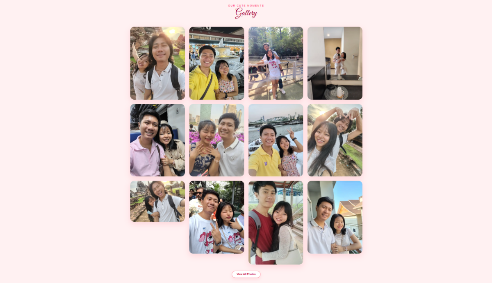
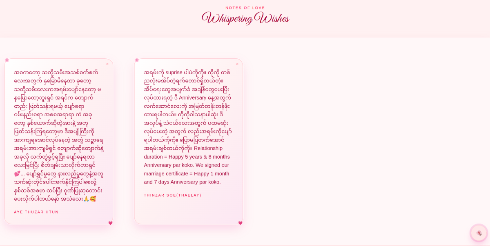
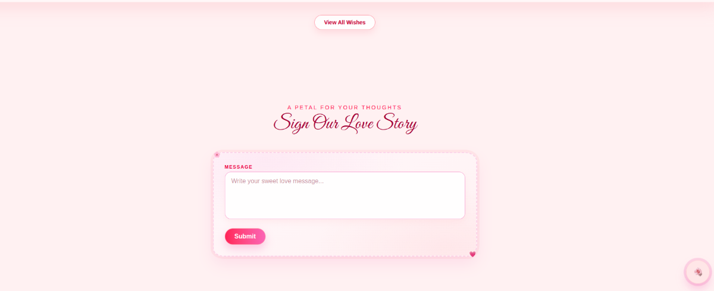

# Eternal Us 💖

**Eternal Us** is a full-stack romantic web application designed to preserve and celebrate a couple’s journey.
It allows users to create memories, share wishes, manage galleries, and automatically celebrate anniversaries through scheduled email delivery.

---

## ✨ Features

### 🧭 Journey Timeline System

- Create, update, and display relationship milestones
- Chronological ordering by `journey_date`
- Pagination support (4 items per page)
- Image-supported storytelling

### 🖼️ Gallery Management

- Upload single or multiple images
- Batch insert for multiple uploads
- Image replacement support
- Preview + paginated gallery view

### 🖼️ Cover Image System

- Single “cover” image (latest only)
- Automatically replaces old cover (S3 cleanup included)

### 💬 Wish / Feedback System

- Authenticated users can send wishes
- Public feedback wall (marquee + paginated)
- Displays user name + styled tones

### 🌹 Interactive UI (Frontend UX)

- Floating Action Button (FAB) for quick actions
- Dynamic modal system (Journey / Gallery / Cover)
- Inline editing support
- Smooth SPA experience via Inertia.js

---

## ⚡ Performance Optimizations

### 🖼️ Image Optimization

- Client-side image compression (converted to **WebP** before upload)
- Automatic resizing (max dimension ~900px)
- Reduced payload size → faster uploads & rendering

### 🚀 Network & Delivery Optimization

- **AWS S3** for scalable storage
- **AWS CloudFront (CDN)** for fast global content delivery
- Optimized asset loading for reduced latency

### ⚡ Loading Performance

- Lazy loading images (improves initial load time)
- Preloading critical assets
- Reduced blocking resources for smoother UX

### 🧠 Smart Data Handling

- Server-side caching (5 minutes TTL)
- Cache versioning for instant invalidation
- Lazy-loaded Inertia props (partial reload optimization)

---

## 📧 Anniversary Email System

- Automatic anniversary detection:
    - Relationship anniversary
    - Marriage anniversary

- Dynamic email template selection:
    - Romantic (for wife)
    - Announcement (for others)

- Daily scheduled email sending (08:00)

---

## 🛠️ Tech Stack

### Frontend

- Vue 3 (Composition API)
- TypeScript
- Inertia.js

### Backend

- Laravel
- Laravel Fortify (Authentication)
- Policy-based authorization (`can:manage-couple-content`)

### Database

- MySQL (Eloquent ORM)

### Storage & CDN

- AWS S3
- AWS CloudFront (CDN)

### Email

- Laravel Mailables
- Queue system
- Blade templates

---

## ⚙️ Architecture Overview

### 🔹 Inertia SPA Pattern

- Laravel handles routing
- Vue handles rendering
- No separate API layer required

### 🔹 Service Layer Design

- `HomePageDataService` → payload building + caching
- `MediaManagerService` → media upload & lifecycle (S3)
- `WishService` → wish creation logic
- `AnniversaryService` → anniversary calculation logic

---

## 📁 Project Structure

```bash
app/
├── Http/
│   └── Controllers/
│       └── ActionController.php
├── Models/
│   ├── User.php
│   ├── Journey.php
│   ├── Gallery.php
│   ├── Cover.php
│   └── Wish.php
├── Services/
│   ├── HomePageDataService.php
│   ├── MediaManagerService.php
│   ├── WishService.php
│   └── AnniversaryService.php
├── Mail/
│   └── AnniversaryMail.php

resources/
├── js/
│   ├── pages/
│   │   └── Welcome.vue
│   ├── components/
│   │   ├── HeroSection.vue
│   │   ├── RoadMapJourney.vue
│   │   ├── Gallery.vue
│   │   ├── FeedbackWall.vue
│   │   ├── FeedbackForm.vue
│   │   ├── FloatingRoseFab.vue
│   │   └── FabActionModal.vue
│   └── app.ts
├── views/
│   ├── app.blade.php
│   └── email/
│       ├── Marriage/
│       └── Relationship/
├── css/
│   └── app.css

routes/
├── web.php
└── console.php
```

---

## 🔐 Authorization

- Protected routes via:

    ```
    auth + can:manage-couple-content
    ```

- Only authorized users can manage:
    - Journey
    - Gallery
    - Cover

---

## 🚀 Installation

```bash
git clone https://github.com/Zin-Mg-Nyunt/Eternal_Us.git
cd Eternal_Us

composer install
npm install

cp .env.example .env
php artisan key:generate
php artisan migrate

npm run dev
php artisan serve
```

---

## 🔧 Environment Setup

### AWS

```
AWS_ACCESS_KEY_ID=
AWS_SECRET_ACCESS_KEY=
AWS_DEFAULT_REGION=
AWS_BUCKET=
AWS_URL=   # CloudFront URL
```

### Mail

```
MAIL_MAILER=
MAIL_HOST=
MAIL_PORT=
MAIL_USERNAME=
MAIL_PASSWORD=
```

---

## ⏱️ Scheduler

```bash
php artisan schedule:work
```

---

## 📸 Screenshots

### 🏠 Home Page



### 🧭 Journey Timeline



### 🖼️ Gallery



### 💬 Wishes



### ⌨️ Wishes Form



---

## 🌱 Future Improvements

- Couple account linking
- Real-time chat
- Notifications
- Mobile optimization
- Dark mode

---

## 👨‍💻 Author

Zin Mg Nyunt
